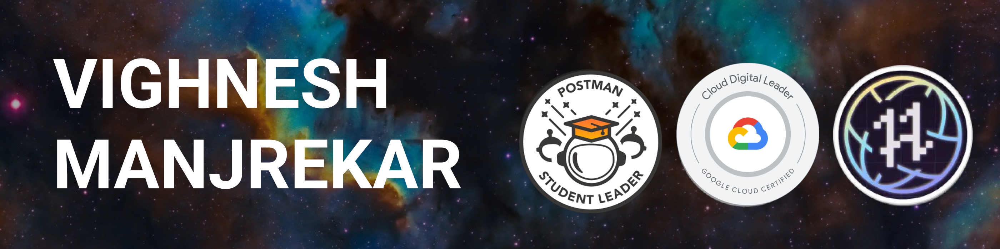

# Hello👋

<!-- insert banner image -->

I'm a student/learner/developer based in Mumbai, India. Welcome to my GitHub profile!

- 🌱 I'm currently exploring React
- 💬 Ask me about Node.js
- 📫 How to reach me: [mail](vighneshmanjrekar4193@gmail.com)

## Languages and Tools I've worked with

> Jack of all trades, master of none, though oftentimes better than master of one.

 

## Get in Touch

🐦 [Twitter](https://twitter.com/Vighnesh73)
💼 [LinkedIn](https://www.linkedin.com/in/vighnesh-manjrekar/)
